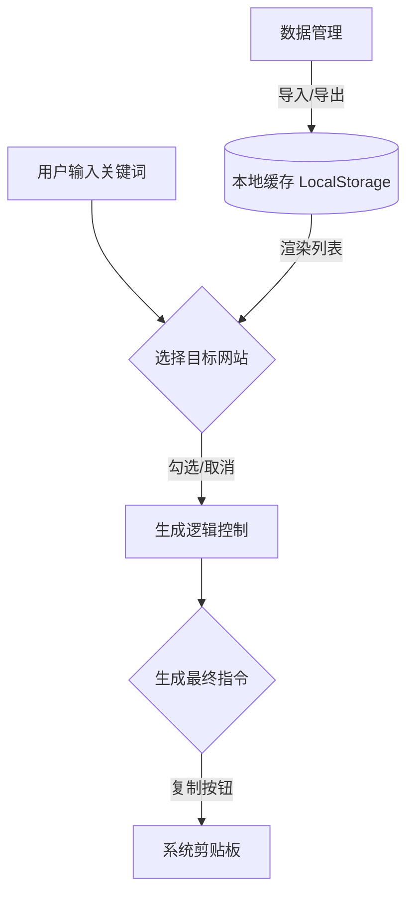
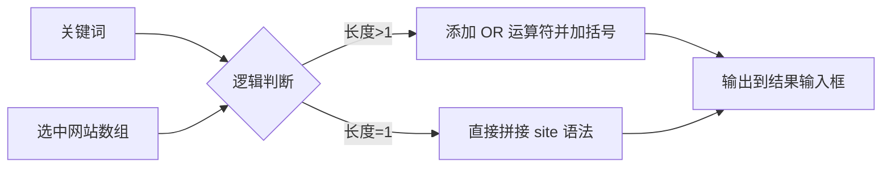
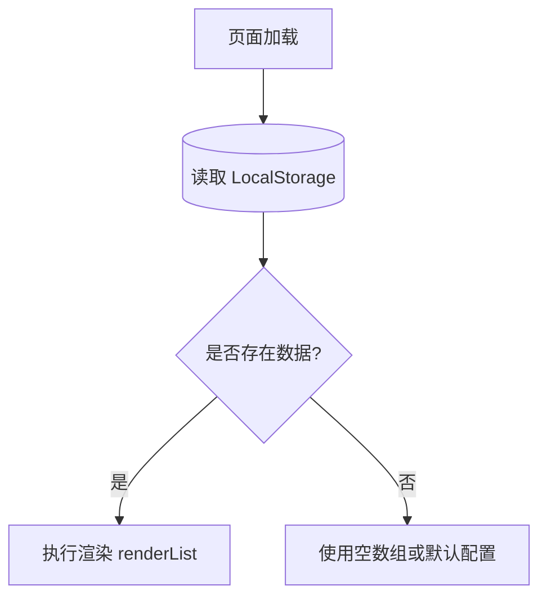
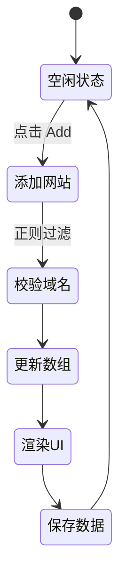
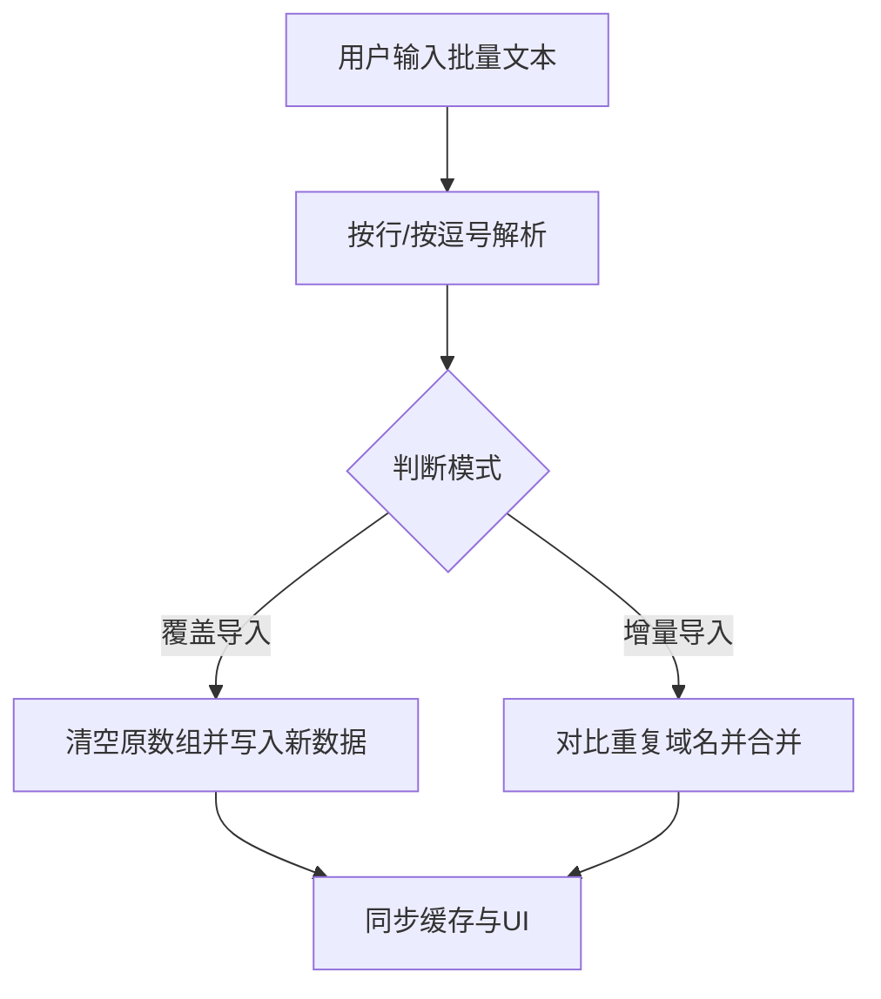

# 网站指定搜索指令合成器 | Site-Specific Search Command Generator

这款工具旨在通过自动化合成高级搜索指令（`site:` 运算符），帮助用户摆脱繁杂的手动输入，实现一键跨站点的精准内容聚合。

---

## 一、 整体架构说明 (Overall Architecture)

本程序采用纯前端架构，基于 **HTML5 + CSS + JavaScript** 实现，无需任何后端服务器。数据通过浏览器 `localStorage` 实现本地持久化。

### 1.1 核心流程图

---

## 二、 核心功能模块详解 (Functional Modules)

### 2.1 搜索指令生成模块 (Search Command Generator)
**功能描述**：该模块负责根据用户输入的关键词以及已勾选的域名，按照搜索引擎的高级语法规则进行逻辑合并。

**核心函数：**
* `generateCommand()`: 
    * **用途**：提取 `searchInput` 中的值，过滤 `sites` 数组中 `checked: true` 的项。
    * **逻辑**：如果选中多个网站，则使用 `(site:a.com OR site:b.com)` 的格式；单个网站则直接输出 `site:a.com`。最后将结果回填至 `resultInput`。

**局部流程图：**

---

### 2.2 数据持久化与存储模块 (Data Persistence)
**功能描述**：负责将用户自定义的网站列表和语言偏好存储在用户的本地浏览器中，确保页面刷新后数据不丢失。

**核心函数：**
* `saveData()`: 
    * **用途**：将 `sites` 数组和 `currentLang` 变量转换为 JSON 字符串存入 `localStorage`。
* `window.onload`: 
    * **用途**：页面初始化时，从缓存加载数据并调用 `renderList()` 渲染 UI。

**局部流程图：**

---

### 2.3 网站管理与交互模块 (Site Management)
**功能描述**：支持动态添加、删除网站，以及切换选中状态。

**核心函数：**
* `addSite()`: 提取域名和备注，执行正则过滤（去除协议头和路径），推入 `sites` 数组。
* `deleteSite(index)`: 根据索引移除数组中的元素，并同步更新缓存。
* `toggleCheck(index)`: 切换网站的选择状态，用于控制是否参与指令合成。
* `renderList()`: **UI 核心函数**。通过 `innerHTML` 动态构造 HTML 字符串，将数组映射为可交互的 DOM 列表。

**局部流程图：**

---

### 2.4 批量导入/导出模块 (Batch Management)
**功能描述**：提供一个“开发者模式”，允许用户通过 `domain,note` 的 CSV 格式批量管理网站数据。

**核心函数：**
* `openManageModal()`: 将当前 `sites` 数组导出为多行字符串。
* `processImport(isOverwrite)`: 
    * **逻辑**：解析文本域中的每一行。若 `isOverwrite` 为真，则覆盖当前数组；否则采用“增量导入”模式，跳过已存在的域名。

**局部流程图：**

---

### 2.5 国际化模块 (Internationalization)
**功能描述**：通过 `translations` 字典对象实现中英文界面的实时切换，提升全球可用性。

**核心函数：**
* `updateUIStrings()`: 遍历 DOM 树，根据 `currentLang` 修改所有具有 ID 标识的元素的 `textContent` 和 `placeholder`。
* `changeLang(val)`: 用户通过下拉框选择后触发，更新全局状态并调用 `updateUIStrings()`。

---

> **免责声明**：本程序仅用于辅助生成搜索引擎支持的公开指令字符串，不涉及任何侵入式抓取或非授权数据访问。
